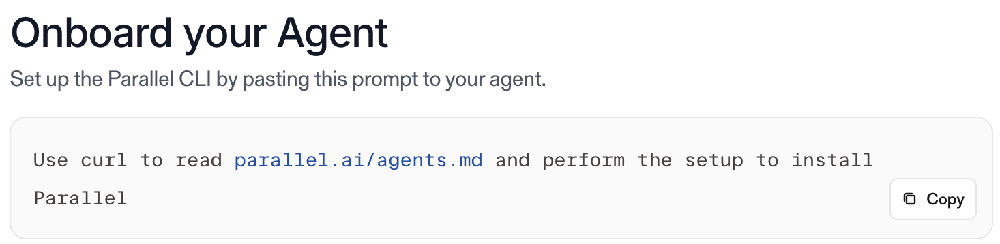
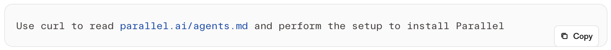

You guys are using Mintlify for your docs, and it seems like you made a custom component for this code block on the [docs homepage](https://docs.parallel.ai/getting-started/overview):



It looks fine at the widest breakpoint, but if you shrink the screen to \<1024px, the sidebar disappears, the code block widens to fill the space and shrinks to one line, and the copy button no longer appears to have any bottom margin:



This is because the copy button is actually trying to be vertically centered, not offset from the bottom-right corner, but this centering is borked! It's wrapped in a div with these classes (here's a snippet from the generated HTML):

```html
<div class="mint-absolute mint-right-3 mint-top-1/2 mint--translate-y-1/2 mint-z-10">
	<button ...>
		...
	</button>
</div>
```

The `mint-*` prefixes indicate you used Tailwind classes in a custom component, since this is how Mintlify processes those for the final output. So in your codebase, I think the component looks something like this:   

```html
<div class="absolute right-3 top-1/2 -translate-y-1/2 z-10">
	<button ...>
		...
	</button>
</div>
```

Normally, the classes `mint-top-1/2 mint--translate-y-1/2` would vertically center this wrapper (offset from the top of the container by 50% of its height, then reverse offset by 50% of its own height).   

`mint--translate-y-1/2` corresponds to this rule in the inline style tag with the `data-custom-css-path="dynamic-tailwind.css"` attribute:

```css
.mint--translate-y-1\/2 {
    --tw-translate-y: -50%;
    transform: translate(var(--tw-translate-x), var(--tw-translate-y)) rotate(var(--tw-rotate)) skewX(var(--tw-skew-x)) skewY(var(--tw-skew-y)) scaleX(var(--tw-scale-x)) scaleY(var(--tw-scale-y));
}
```

But the computed `transform` property for the div wrapper is `none`, because the values for `--tw-rotate`, `--tw-skew-x`, and `--tw-skew-y` are undefined, which causes the whole `transform` property to be invalid!

The `--tw-*` variables are custom properties that Tailwind generates, and they *should* be in the main CSS chunk [(linked from here)](https://docs.parallel.ai/mintlify-assets/_next/static/chunks/313ebeaa2aedc920.css?dpl=dpl_Aes4ZqSDjshAtnaX5zsUswDant97). But the skew properties don't have an initial value:

```css
@property --tw-skew-x {
    syntax: "*";
    inherits: false
}

@property --tw-skew-y {
    syntax: "*";
    inherits: false
}
```

And instead of a `--tw-rotate` property, there are separate rotate properties for each dimension:

```css
@property --tw-rotate-x {
    syntax: "*";
    inherits: false
}

@property --tw-rotate-y {
    syntax: "*";
    inherits: false
}

@property --tw-rotate-z {
    syntax: "*";
    inherits: false
}
```

This suggests that this chunk was generated with Tailwind v4, which added separate `rotate-x-`, `rotate-y-`, and `rotate-z-` classes. But the [Mintlify docs](https://www.mintlify.com/docs/customize/custom-scripts#style-with-tailwind-css) say you're supposed to use Tailwind v3 syntax for custom classes. So I suspect the `.mint--translate-y-1\/2` rule is supposed to work with a Tailwind v3–generated chunk (which would define and add initial values for all the necessary custom properties), but fails when paired with the v4 chunk.

Anyway, you can patch this by adding this to your custom styles (in `styles.css`):   

```css
[class*="mint--translate-"],
[class*="mint-translate-"] {
    --tw-rotate: 0;
    --tw-skew-x: 0;
    --tw-skew-y: 0;
}
```

That should allow you to use `translate-*` classes in custom components without issue. But it's hacky and won't fix bugs that come up if you use other Tailwind classes in custom components, so maybe instead just wait until Mintlify fixes this.

Here's a demo to show that adding this rule successfully centers the button ([source repo](https://github.com/RomanHauksson/mintlify-docs)):

export const MyCodeBlock = () => {
  return (
    <div class="relative">
      <div class="absolute right-3 top-1/2 -translate-y-1/2 z-10">
        <button type="button" class="inline-flex items-center gap-1.5 rounded-md border border-[#e5e5e5] dark:border-[#2a2a2a] bg-white/95 dark:bg-[#1a1a1a]/95 px-2 py-1 text-[12px] font-medium text-[#181818] dark:text-gray-200 transition hover:border-[#FB631B] hover:text-[#FB631B]">
          <svg viewBox="0 0 12 12" class="h-3 w-3" fill="none" stroke="currentColor" stroke-width="1.2" aria-hidden="true">
            <rect x="3.5" y="3.5" width="6" height="6" rx="0.8"></rect>
            <path d="M2 7.5V3.2A1.2 1.2 0 0 1 3.2 2h4.3" stroke-linecap="round"></path>
          </svg>
          Copy
        </button>
      </div>
      <div class="overflow-x-auto rounded-xl border border-gray-200 dark:border-[#2a2a2a] bg-[#fafafa] dark:bg-[#111111] px-4 py-4 pr-20">
        <code class="whitespace-pre-wrap break-words text-gray-900 dark:text-gray-100"><span data-as="p">Use curl to read </span><a href="https://parallel.ai/agents.md" target="_blank" rel="noopener noreferrer"><span data-as="p">parallel.ai/agents.md</span></a><span data-as="p"> and perform the setup to install Parallel</span>
        </code>
      </div>
    </div>
  )
}

<MyCodeBlock />
